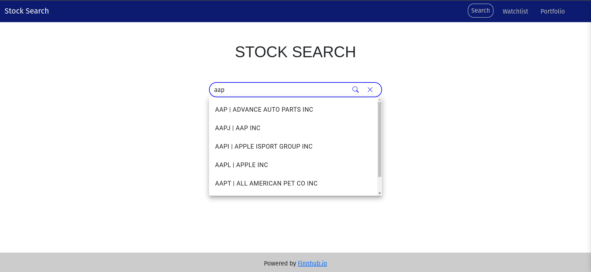
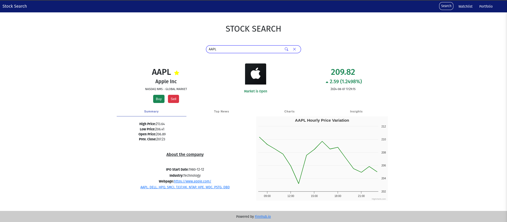
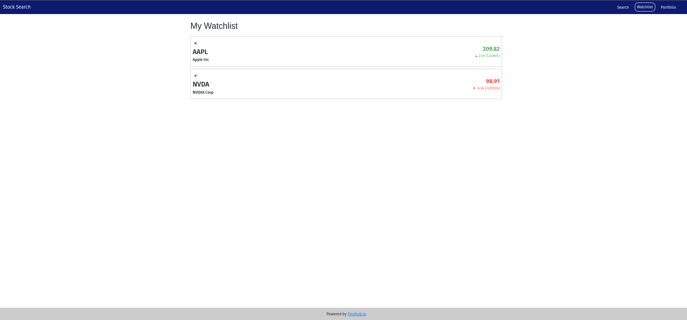
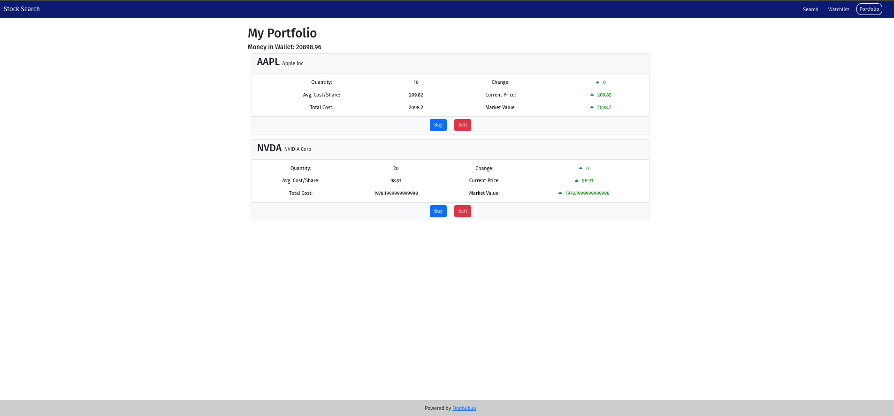

# Stock Search Web Application( Angular (MEAN) )
( React (MERN) under development)

## Overview

This project is a comprehensive web application that allows users to search for stock information, view detailed stock data, manage a watchlist, and handle a portfolio. The application leverages AJAX, JSON, HTML5, Bootstrap, Angular, Node.js, and various cloud services to provide a responsive and interactive user experience.

## Table of Contents

- [Objectives](#objectives)
- [Technologies Used](#technologies-used)
- [Features](#features)
- [Installation](#installation)
- [Usage](#usage)
- [APIs Used](#apis-used)
- [Screenshots](#screenshots)
- [Development](#development)
- [Further Help](#further-help)
- [License](#license)

## Objectives

- Familiarize with AJAX and JSON technologies.
- Use a combination of HTML5, Bootstrap, and Angular on the client side.
- Utilize Node.js on the server side.
- Enhance user experience using responsive design with Bootstrap.
- Gain hands-on experience with cloud services hosting Node.js/Express.
- Implement popular APIs like Finnhub API, Polygon.io API, and Highcharts API.
- Manage and access NoSQL DBMS like MongoDB Atlas.

## Technologies Used

- **Frontend**: HTML5, CSS, Bootstrap, Angular
- **Backend**: Node.js, Express.js
- **APIs**: Finnhub API, Polygon.io API, Highcharts API
- **Database**: MongoDB Atlas
- **Cloud Services**: Google App Engine, AWS Elastic Beanstalk, Microsoft Azure

## Features

1. **Stock Search**: 
   - Autocomplete suggestions for stock ticker symbols using Finnhub API.
   - Display stock details including symbol, company name, trading exchange, and current price.
   - Show stock price variation charts using Highcharts.

2. **Watchlist**:
   - Add stocks to a watchlist stored in MongoDB Atlas.
   - Display watchlist with current stock prices and changes.

3. **Portfolio Management**:
   - Buy and sell stocks.
   - Manage a virtual wallet with an initial balance of $25,000.
   - Track portfolio performance with real-time updates.

4. **Responsive Design**:
   - Ensure compatibility with various devices using Bootstrap.

5. **Real-Time Statistics**:
   - Search for stocks: Enter a stock ticker symbol in the search bar and view detailed information.
   - Manage your watchlist: Add stocks to your watchlist and monitor their performance.
   - Buy and sell stocks: Use the portfolio management feature to handle virtual stock transactions.

## Installation

### Prerequisites

- Node.js and npm
- Angular CLI
- MongoDB Atlas account
- Cloud service account (Google App Engine, AWS, or Azure)

### Steps

1. **Clone the repository**:
   ```bash
   git clone https://github.com/KARTIK-PANDEY-KP/Stock_Trading_Website.git
   cd Stock_Trading_Website
   ```

2. **Install dependencies**:
   ```bash
   npm install
   ```

3. **Set up environment variables**:
   - Add your API keys and other configurations in the index.js file(in NODE_SERVER folder)
     ```env
     FINNHUB_API_KEY=your_finnhub_api_key
     POLYGON_API_KEY=your_polygon_api_key
     MONGODB_URI=your_mongodb_atlas_uri
     ```

4. **Start the server**:
   ```bash
   cd NODE_SERVER
   npm start
   ```

5. **Run the Angular application**:
   ```bash
   ng serve
   ```

## Usage

1. **Search for stocks**: Enter a stock ticker symbol in the search bar and view detailed information.
2. **Manage your watchlist**: Add stocks to your watchlist and monitor their performance.
3. **Buy and sell stocks**: Use the portfolio management feature to handle virtual stock transactions.

## APIs Used

- **Finnhub API**: For retrieving stock symbols, company profiles, stock quotes, and news.
- **Polygon.io API**: For historical stock data.
- **Highcharts API**: For rendering stock price and volume charts.

## Screenshots

### Search Page


### Stock Details


### Watchlist


### Portfolio


## Development

This project was generated with [Angular CLI](https://github.com/angular/angular-cli) version 17.3.1.

### Development server

Run `ng serve` for a dev server. Navigate to `http://localhost:4200/`. The application will automatically reload if you change any of the source files.

### Code scaffolding

Run `ng generate component component-name` to generate a new component. You can also use `ng generate directive|pipe|service|class|guard|interface|enum|module`.

### Build

Run `ng build` to build the project. The build artifacts will be stored in the `dist/` directory.

### Running unit tests

Run `ng test` to execute the unit tests via [Karma](https://karma-runner.github.io).

### Running end-to-end tests

Run `ng e2e` to execute the end-to-end tests via a platform of your choice. To use this command, you need to first add a package that implements end-to-end testing capabilities.

## Further Help

To get more help on the Angular CLI use `ng help` or go check out the [Angular CLI Overview and Command Reference](https://angular.io/cli) page.

## License

This project is licensed under the MIT License - see the [LICENSE](LICENSE) file for details.
